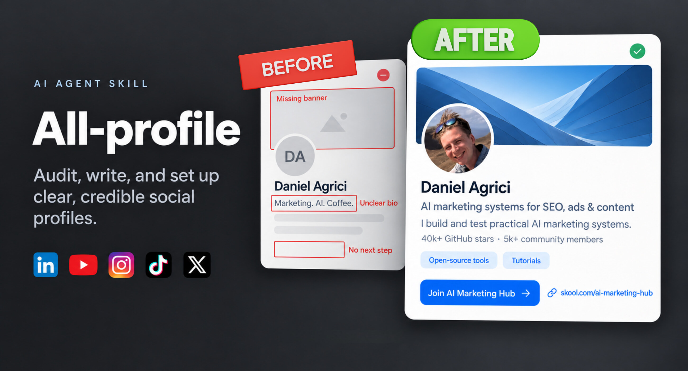

# All-profile



**Make your social profiles say what you do, show why it matters, and guide people to the right next step.**

All-profile is an AI agent skill for improving your **LinkedIn, YouTube, Instagram, TikTok, and X** profiles. It helps turn your actual work into clear bios, headlines, descriptions, and links. When you approve the changes and your agent has account access, it can also apply them and check what saved.

One recognizable message. Relevant proof. A natural next step.

[Get started](#get-started) · [Example prompts](#try-it) · [Release notes](CHANGELOG.md) · [Validation](tests/VALIDATION.md)

## What you can do with it

- **Find your message.** Explain what you do and who it helps, without vague titles or hype.
- **Write better profiles.** Get ready-to-paste copy that fits each platform and sounds like you.
- **Use proof properly.** Bring in your projects, portfolio, experience, or carefully checked numbers.
- **Keep profiles consistent.** Carry the same identity across platforms without pasting the same paragraph everywhere.
- **Set things up.** Apply approved text and links, review relevant profile sections, and keep effective existing images.
- **Know what is finished.** See what saved, what was verified, and what still needs a manual step.

Use it for one bio or a complete profile refresh. It is useful for creators, founders, independent professionals, and teams maintaining a brand's social presence. Available fields differ between personal and brand accounts, so the agent checks the actual account before proposing changes.

## How it works

1. **Understand you.** Start with your work, audience, current profiles, and the action you want visitors to take.
2. **Review the evidence.** Check your claims and learn from any examples or screenshots you provide.
3. **Prepare the copy.** Adapt your message to each requested field, with useful proof and a clear invitation.
4. **Review the changes.** See the exact wording and destinations before anything is saved to an account.
5. **Apply and check.** With your approval and suitable account access, the agent saves the changes, checks the result, and records anything still pending.

The details matter: paragraph breaks, emoji, link order, free versus paid destinations, and mobile-only controls all have a place in the workflow. A save message alone is not treated as proof that visitors see the intended result.

## Get started

### What you need

An AI agent that supports Agent Skills. Drafting can work from information you supply, without signing into your social accounts. Fresh research needs web access. Applying changes needs a supported browser or connector and your normal account sign-in.

The skill does not include a browser, manage passwords, or require a paid API. Never paste passwords or session tokens into your brief.

### Install for a Codex project

1. Download this repository, or the `all-profile-skill-v0.1.0-beta.2.zip` file from the [release](https://github.com/AgriciDaniel/all-profile/releases/tag/v0.1.0-beta.2).
2. Copy the entire `all-profile` skill folder into `.agents/skills/` inside the project where you use Codex. In this repository, that folder is `skills/all-profile`. In the skill ZIP, it is `all-profile`.
3. Check that the resulting path is `.agents/skills/all-profile/SKILL.md`, with its supporting folders beside it.
4. Open Codex in that project and select the skill, or mention `$all-profile` in Codex CLI or the IDE extension. Restart Codex if it does not appear.

If you already have an `all-profile` folder there, compare versions before replacing it. Keep your client work outside the installed skill folder.

Project-local discovery was checked with Codex CLI 0.153.4. See [current Codex setup guidance](https://developers.openai.com/codex/skills) if the interface has changed. Other compatible agents may use different install locations or invocation syntax; their installation paths have not been tested here.

## Try it

**Start with a review**

```text
Use $all-profile to review my LinkedIn and Instagram profiles.
Here are the URLs and my portfolio. Tell me what to improve before changing anything.
```

**Write one profile**

```text
Use $all-profile to write my LinkedIn headline and About section.
I build accessible learning websites for small education teams.
Here are my three public demos. Keep it friendly and use a few useful emojis.
```

**Refresh several profiles**

```text
Use $all-profile to prepare consistent copy for my LinkedIn, YouTube,
Instagram, TikTok, and X profiles. My goal is to bring people to my portfolio.
Use the work and voice examples I have supplied. Prepare the changes for review.
```

**Apply approved changes**

```text
Use $all-profile to apply the exact changes I approved above.
Check the saved text and links, then tell me what is complete and what remains.
```

You do not need a perfect brief. Share what you have: your name or brand, platforms, current copy, portfolio or other proof, tone, and desired destination. The skill asks only for missing details that affect the result.

## What you receive

For a writing task, you get copy for the requested fields, plus useful evidence notes and any unresolved questions. Verification details stay separate from the text visitors will read.

For an approved setup, you also get the actual saved values, retained elements, checks performed, and precise next steps for anything blocked. If a link can only be changed in a mobile app, the agent says so instead of claiming the profile is finished.

## Coverage and limits

The included playbooks cover LinkedIn, YouTube channels, Instagram, TikTok, and X. They also guide relevant supporting sections, such as LinkedIn Featured and Experience or YouTube channel links, when requested. New platforms require fresh research.

This skill focuses on profiles. Social content calendars, individual post or video descriptions, account-ban investigations, and GitHub repository descriptions are separate tasks.

It does not invent achievements, turn followers into customers, or promise higher rankings, reach, or sales. Platform features change, so the agent checks current requirements when applying the skill.

## Checked before this preview

- Six automated tests passed.
- A fresh Codex process discovered the installed skill with the correct name and metadata.
- An independent review found no substantive blocker to local use.
- Four fictional writing and reconciliation tasks were evaluated.
- A mocked setup test preserved the approved paragraphs and handled a save timeout without duplicate saving or unrelated changes.

One writing issue found during evaluation was corrected and rechecked. The extracted skill has **not yet had an end-to-end trial on real social accounts**. Read the [validation record](tests/VALIDATION.md) for the exact coverage.

For contributors, local checks are simple:

```bash
python3 -m unittest discover -s tests -v
```

Python 3.9 or later is needed only for the optional text counter and these local tests. The skill itself is readable instructions in the [Agent Skills format](https://agentskills.io/specification).

## About this release

**v0.1.0-beta.2** is the first public beta, following a private preview. It packages lessons from a five-platform profile project, including research, writing revisions, recorded setup, and verification. Personal account records, screenshots, and private workspace files are excluded.

See the [release notes](docs/releases/v0.1.0-beta.2.md), [change history](CHANGELOG.md), and [contribution guide](CONTRIBUTING.md). Method inspiration is credited in the [evidence and copy guide](skills/all-profile/references/evidence-and-copy.md).

**License:** the skill, code, and documentation are available under the [MIT License](LICENSE). The cover artwork, portrait, and third-party branding are excluded; see [artwork and branding](assets/README.md).
